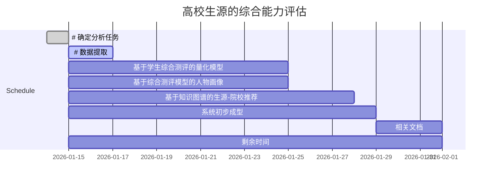

### 学生综合素质评价可视化

>  本次赛题需要根据所给的学生文档数据，建立高中学生综合素质评价信息的可视化评价模型，具体包含：（1）可供高校一目了然了解学生概况（2）可供高校对比不同学生之间的情况。此模型能够评估学生能力，为高校输送合适的人才。

##### 数据

> 数据由每个学生的学生档案构成，学生档案模板统一，详细内容见模板描述。（  **综合素质档案**   ）

##### 提交要求：

> 参赛者提供解决方案设计说明书， word或pdf格式+ ppt，作品以压缩文件zip格式统一提交。内容要求（包括但不限于）：
>
> - 清晰定义的问题——清晰定义作品计划解决的问题，描述问题造成的相关影响。
> - 架构完整的方案——设计架构完整、逻辑清晰的解决方案，整体方案需确保技术可行和可落地。
> - 可衡量的价值——说明方案如何解决所提出的问题，指出方案的独特价值和亮点。
> - 提交作品中，包含产品原型会有额外加分，产品原型可以基于手机APP、Web页面、微信小程序等呈现。

##### 任务分析

**分析目标**

> **高中学生综合素质评价信息的可视化评价模型**

**任务分析**

> ①  基于学生综合测评的量化模型  ②  基于综合测评模型的人物画像 ③  基于知识图谱的生源-院校推荐

- ①  基于学生综合测评的量化模型

> 基于综合测评档案数据对学生综合素质进行量化（ 德行素质 、 发展素质 、 智力素质 、 体育素质 、艺术素质  ）

- ②  基于综合测评模型的人物画像

> **高中学生综合素质评价信息的可视化评价模型**  （学生聚类分析  、学生人物画像、可视对比）

- ③  基于知识图谱的生源-院校推荐

> 结合已有的知识图谱进行双向推荐，向院校推荐学生-向学生推荐院校

- ④  基于学生成绩的教学能力评估

>

-  ⑤ 基于学习成绩的学科相关性分析

>

##### 分工与合作

> （L. Liu）

①  基于学生综合测评的量化模型

> （X. Li and H. Li）

②  基于综合测评模型的人物画像

> （T. Cai and H. Wu）

③  基于知识图谱的生源-院校推荐

    
Current ---------- 2021.01.14

    
Next Check ------- 2021.01.17

    针对各个任务给出初步解决方案
    
Next Check ------- 2021.01.25

    完成各个模块的解决方案、优化解决方案、提出新的解决方案
    
Next Check ------- 2021.01.29

    系统模块集成，开开始撰写相关文档
    
Deadline--- ------- 2021.02.01

    完成所有任务，系统成型，相关文档完成

